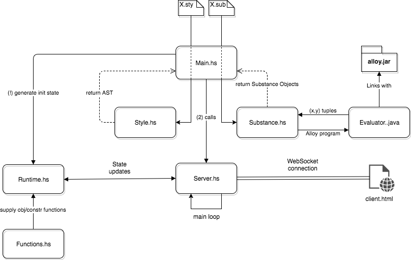
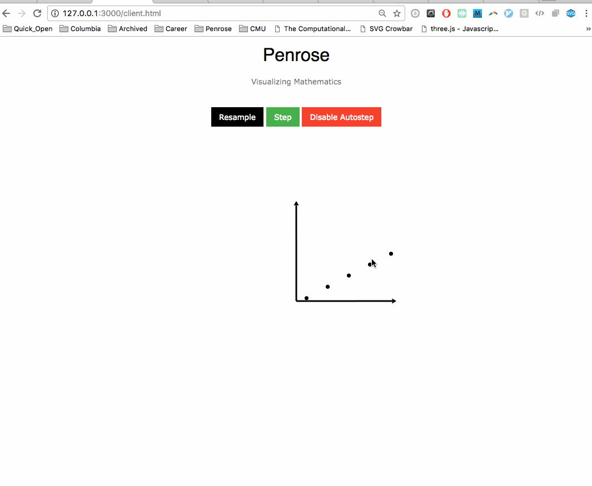

# Penrose Summer 2017 Ramp-down document

This document records the status of Penrose after Nimo's REU program in summer 2017, and provides some ideas about what to do next.

## Overview

- We will refer to the project root directory as "TOP" in this document

## Dependencies

- The fastest way to get the dependencies right is to `cabal install`, because all dependencies are specified in `TOP/penrose.cabal`. You can always inspect the file manually to see specific requirements.
- For Alloy support, you will need a JRE. Here is my version:
```
java version "1.8.0_25"
Java(TM) SE Runtime Environment (build 1.8.0_25-b17)
Java HotSpot(TM) 64-Bit Server VM (build 25.25-b02, mixed mode)
```

## Building the project

- There are three ways to build the Haskell project:
    - `ghc Main` in `TOP/src`. As usual, it creates all temp files in the current directory
    - `cabal build` in TOP, which will build the binary at `TOP/dist/build/penrose`
        - Feel free to add that build directory in your `$PATH`
        - You can also build the project in arbitrary directories by add the `--builddir=<target-dir>`
    - `cabal install` in TOP, which will build the binary at `TOP/.cabal-sandbox/bin`
        - This install normally happens in a sandbox. You can simply execute `cabal sandbox init` in TOP the first time you clone the project from GitHub. It will take quite a while to build for the first time.
        - cabal seems to have problem resolving the dependencies sometimes. Try prepending `sudo`, and adding the flag `--reorder-goals` if there is any bizarre problem.
        - For some reason, the binary built this way tends to run faster. I didn't look into the cause, which might be some default optimization by cabal
- If you are running Penrose on instances that requires Alloy support, you will also need to build the file `Evaluator.java`. You can do so by executing `make` in `TOP/src`.
- In the future, if we include more libraries in our project, `penrose.cabal` needs to be updated accordingly. `cabal gen-bounds` will automatically generate upper/lower bounds of newly linked packages.
- You can also `make clean` to clean up `TOP/src`, removing all intermediate files are temp files such as `__temp__.als` (byproduct of integration with Alloy).


## Running the project

- Here are some usable examples in the code base:
    - Deep nested sets: `nested.sub` and `venn.sty`
        - Any general set programs with `venn.sty`/`tree.sty` would work.
            - For example: `twosets.sub` and `venn.sty`
    - Surjection with randomized instances: `surjection-demo.sub` and `surjection-demo.sty`
    - composition of functions: `composition.sub` and `composition.sty`
    - two visualizations of sets: `tree.sub` and `tree.sty`/`venn.sty`
    - continuous map: `continuousmap.sub` and `continuousmap.sty`

## Documentation

- The documentation of Penrose is generated using Haddock, a tool similar to Javadoc. Find the grammar of the markup language [here](http://haskell-haddock.readthedocs.io/en/latest/markup.html)
- An HTML documentation site can be generated in `TOP` using:
```
cabal haddock --hyperlink-source --executables  --html-location='http://hackage.haskell.org/package/penrose/docs'  --haddock-options=--no-print-missing-docs
```
After the generation, `haddock` would report a path to `index.html` of the documentation site relative to `TOP`
- By default, all top-level functions will appear in the documentation page. Adding `{-# OPTIONS_HADDOCK prune #-}` will hide undocumented ones and only show documented ones.

## Structure of the project

- Here is a diagram of the overall structure of the project: 
- The project is now divided into modules. When you are working on a particular module, for example, you can just compile that module using `ghc <module-name>`.

## Language Spec

For both languages, we use `-- This is a comment` for single line comments and `/* this can be many lines of comments */` for multi-line comments

### Substance

- Types of objects we support:
    - Sets:
        - Standard declaration: `Set A`
        - List declaration: `Set A, B, C`
        - Declaring with elements: `Set A = { a, b, c }` which would get expanded into multiple `Point` declarations and `PointIn` constraints.
    - Points: `Point p`, `Point a, b`
    - Functions/Maps: `f: A -> B`
        - the two arguments much be existing IDs of `Set` type
    - Definitions of functions:
        - Logical quantifiers: `forall`, `exists`. Each quantifier keyword can lead a comma-separated list of bindings such as `y : Y`, meaning "point/element y in set Y"
        - `|` the vertical bar divides logical quantifiers
        - After a series quantifiers, one can write logical expressions related to functions. For example, `f(x) = a`, meaning "function f maps x to a"
        - Logical expressions can be combined by the following operators: `=, !=, /\, \/, implies`
        - For now, Penrose does not "understand" these expressions at all. It just translates it to some AST representation and send it off to the Penrose-to-Alloy pretty printer
    - "Application" of functions: we can apply a definition on a generic function like `f: A -> B` and other objects(although functions and the from- and to-sets are the only things we have tried so far).

### Style

- See documentation and type definitions in `Style.hs` for grammar (TODO: summerize it later)
- There are also some assumptions and hacks in the file marked with either `NOTE` or `TODO`

## The cartesian coordinate viz: early attempts

- Shortly after my meeting with Keenan, I attempted to first try generating some points using optimization-based approach.
- I wrote the following functions(not in `master` now):
```haskell
-- Here the first argument `l` is a list of points. I believe the logic is to encourage a point with higher x value to be closer to the midpoint between it and the point with lower x value. Not sure if that make sense
increasingX :: ObjFn
increasingX l _ = sum $ map f $ zip l' (drop 1 l')
    where l' = map getX l
          f (y0, y1) = (y1 - (y0 + y1) / 2)^2

increasingY :: ObjFn
increasingY l _ = sum $ map f $ zip l' (drop 1 l')
    where l' = map getY l
          f (x0, x1) = (x1 - (x0 + x1) / 2)^2
```
Got this result when applied both functions:

When only applied `increasingX`

Other than that, I didn't try much because it was about the last week of the REU. Also wrote a couple of auxiliary objective functions to get the points together and the arrows working:
```haskell
xInRange :: ObjFn
xInRange l [xmin, xmax] = (minimum xs - xmin)^2 + (maximum xs - xmax)^2 + sum ( map f xs)
    where xs = map getX l
          f x = (max 0 $ xmax - x)^2 + (max 0 $ x - xmin)^2
yInRange :: ObjFn
yInRange l [ymin, ymax] = (minimum ys - ymin)^2 + (maximum ys - ymax)^2 + sum (map f ys)
    where ys = map getY l
          f y = (max 0 $ ymax - y)^2 + (max 0 $ y - ymin)^2
onthogonal :: ObjFn
onthogonal [A' a1, A' a2] _ = (crossL [startx' a1, starty' a1] [startx' a2, starty' a2]) ^2
horizontal :: ObjFn
horizontal [A' a] _ = (starty' a - endy' a)^2
upright :: ObjFn
upright [A' a] _ = (startx' a - endx' a)^2
```

## Composing Functions

- The earlier version before summer 2017 hardcode objective/constraint functions and provide no flexibility in the amount of parameters that a function can take.
- Now we allow addition of function by 2 steps, all performed in `Functions` module:
    1. Write the function using our predefined types:
    ```haskell
    type ObjFn = forall a. (Floating a, Real a, Show a, Ord a) => [Obj' a] -> [a]-> a
    type ConstrFn = forall a. (Floating a, Real a, Show a, Ord a) => [Obj' a] -> [a]-> a
    ```
    For instance, you can write:
    ```haskell
    repel :: ObjFn
    repel [C' c, S' d] _ = 1 / distsq (xc' c, yc' c) (xs' d, ys' d) - r' c - side' d + epsd
    ```
    2. Add the name of the function to a predefined dictionary.
        - If you want to change the weight of a particular function, the only (hacky) way of doing so is to multiply the function with desired weights. For example, ``("repel", (*)  900000  `compose2` repel)`` add a large weight to `repel`.
        - Note that `compose2` is required for constraint functions because we are composing multiplication with a 2-arg function here.
- Notice the parameters to the functions are actually a list of objects and a list of polymorphic numbers, allowing to pass both numbers and objects. For instance, `onTop(A, B, 50)` makes sure `A` is 50 units above `B`.
- We might be able to encode individual weights in this way, too
- The dictionaries are used in `Style` module, where the system performs lookups using strings of functions names and package a list of functions. This list is later used by `Runtime`, which does optimization pretty much in the same way as the old system.

## Known problems

- Don't panic if there is some parsing error when you run one of the \*jection examples. Alloy sometimes returns __an empty function__, which I pretty much disregarded and let it failed.
- Got an error from cabal once: `cabal: The timestamps file is corrupted. Please delete and recreate the sandbox.` Solved it by deleting `TOP/.cabal-sandbox/add-source-timestamps`

- (below are notes for myself)
- TODO: make specified sets working with non-specified ones
- TODO: make the dot operator working
- TODO: This throws error as expected
```
Point a
In a A
Set A = { a, b }
```
but this does not
```
Point a
Set A = { a, b }
```

## Next semester...
