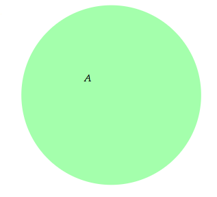
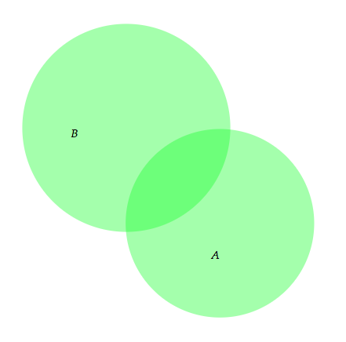
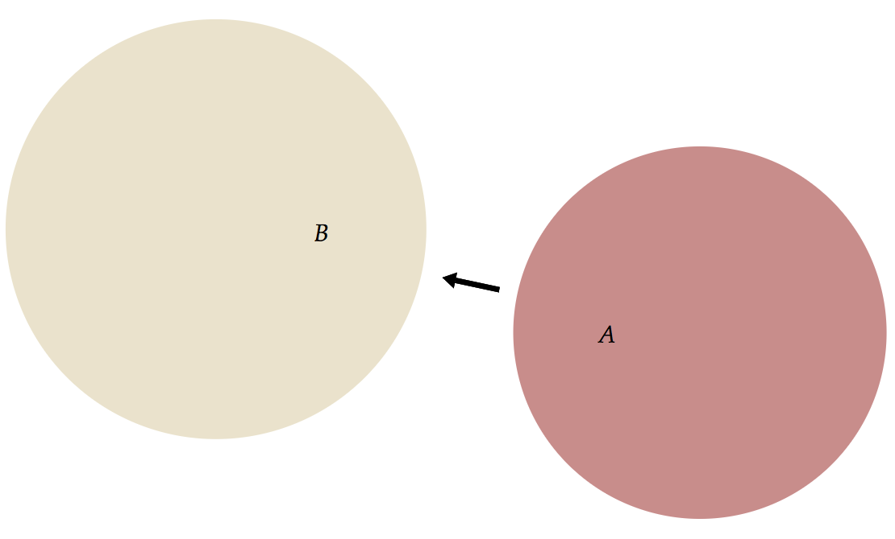
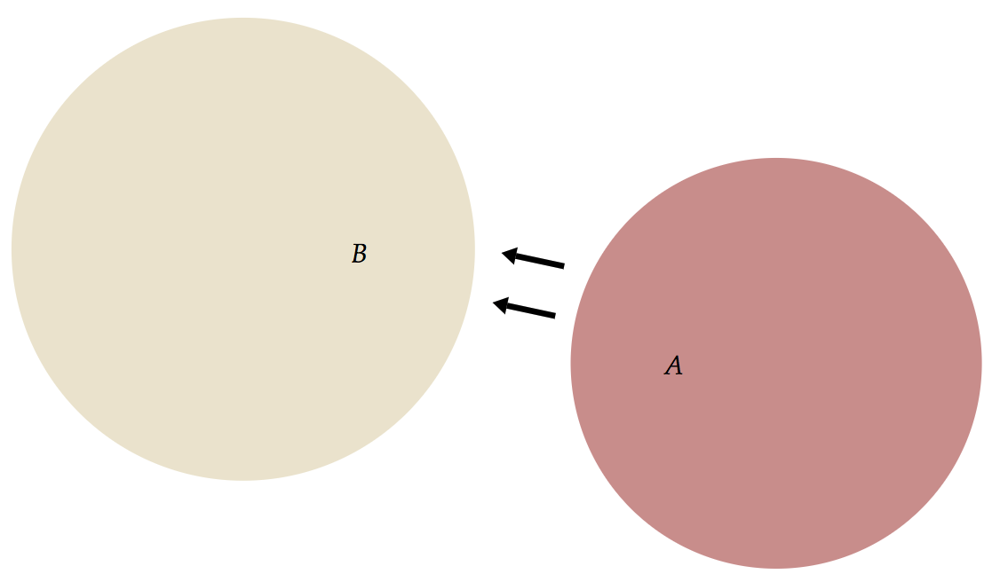
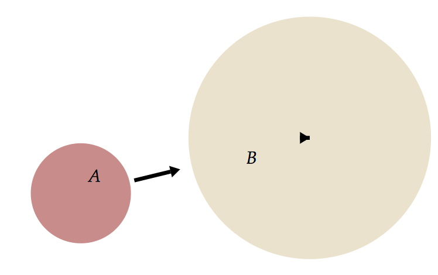
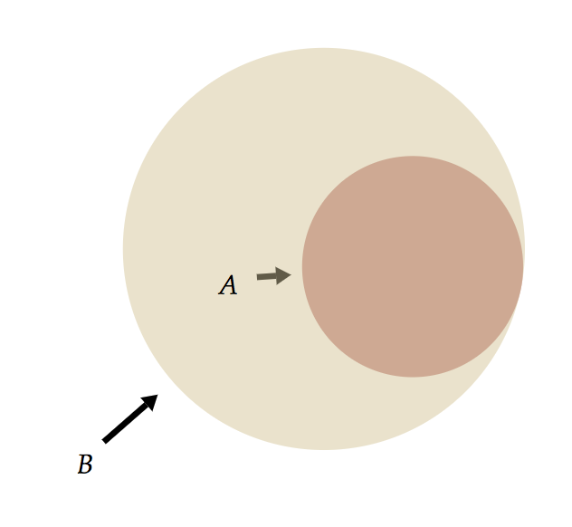

# Penrose Parsers Documentation

## Introduction

:sparkles:Welcome:sparkles:

As you might already know, the Penrose system has two _extensible_ DSLs. Therefore, in our implementation, we have two parsers for Substance and Style.

We use a parser combinator library, [Megaparsec](https://hackage.haskell.org/package/megaparsec), to build the parsers. This library builds on top of the [Parsec](https://hackage.haskell.org/package/parsec) library. For starters, you can follow the blog posts on Megaparsec:

[Parsing a simple imperative language ](https://markkarpov.com/megaparsec/parsing-simple-imperative-language.html)
[Beginner's guide to Megaparsec](http://akashagrawal.me/beginners-guide-to-megaparsec/)

Megaparsec is a [__parser combinator__](https://en.wikipedia.org/wiki/Parser_combinator), which is another popular type of parser other than parser generators (`yacc` is an example of a parser generator). A couple special things about parser combinators:

- By default, there is no explicit lexing stage in the compiler. Instead, lexical analysis is done during the parsing phase. (Megaparsec claims to support output from `alex`, a lexer library in Haskell, but we never tested it)
- You essentially write small parser functions and "glue" them together in a bigger function. In Haskell, you connect these little parser functions by [__applicatives__](https://hackage.haskell.org/package/base-4.10.1.0/docs/Control-Applicative.html). (I'm not going to all the Haskell details here)

## Design Rationale

- Why a parser combinator? (Katherine's answer from Slack)
    - Comparison of parser combinators vs. parser generators. https://softwareengineering.stackexchange.com/questions/338665/when-to-use-a-parser-combinator-when-to-use-a-parser-generator
    - Using a parser generator requires writing the grammar in another DSL, which not Haskell. So we'd need to keep two copies of the grammar around, one in e.g. Happy (the Haskell library's DSL), one in Haskell. But the parser *is* directly generated from the grammar, which is a nice, direct approach.

## Language specification

### Naming conventions

- Identifiers must start with a letter ([A-Za-z]) and followed by alphanumeric characters.
- Names that start with an underscore character (`_`) is reserved by the compiler
    - For now, the use of these name is for a Substance object that does not have an explicit name. For example, `Subset A B` mathematically describes a relation between two `Set`, but is treated as an "object" (TODO: using the term loosely. Katherine refer to them as "constraints" in earlier documents) in the system, i.e. you can associate shapes with this object - as shown in `TOP/src/sty/tree.sty`.
    - In this case, the system internally creates an identifier for a constraint (see `getConstrTuples` in `Style.hs` for implementation), which essentially concatenates the statement string and adds an `_` before the string. (`Subset A B` :arrow_right: `_SubsetAB`)
        - TODO: Probably not the best implementation, any more principled way?

### Keywords and Reserved words

- Keywords
    - Optimization
        - `avoid`
        - `constraint`
        - `objective`
        - Note that in the DSLDI paper, we used `ensure` and `encourage`, but in development we are still using `constraint` and `objective`. This can be easily changed in the parser if needed.
    - Selectors
        - `global`
    - Classes of graphical primitives
        - `Color`   
        - `None`
        - `Auto`
        - `Arrow`   
        - `Text`    
        - `Circle`  
        - `Curve`   
        - `Ellipse`   
        - `Box`     
    - Primary shape of a Substance object: `shape`
- Reserved words
    - Inside of constructors (e.g.: `Arrow { start = xx; end = xx}`)
        - To properly construct a graphical primitive, a set of parameters are often required. Different primitives often require different sets of parameters.
        - The exact set of parameters are determined by the `init*` functions in `Runtime.hs`, where each function calls `queryCondig_*` to look for values associated with certain reserved words.
        - For example, an Arrow requires `start` and `end`. Optionally, you can provide `label`, too.
        - TODO: this implementation does not scale. Therefore, we are working on a more generalized version.
    - Optimization/Computation
        - Depends on the state of the style and computation dictionaries. All entries in these dictionaries are reserved words.
            - See `Computation.hs` and `Functions.hs` for the dictionary entries

### Pattern matching

- Each Style block begins with a list of selectors separated by commas
- A selector can either be `global` or typed
    - Global selector: `global`
        - Matches with all Substance identifiers
        - This is primarily for testing purposes. It gives exactly one selection. You can declare some "global objectives" and be sure that only one copy of it will be in the system.
        - To elaborate, you technically have access to all Substance identifiers everywhere, but if you do `Set X { objective A onTop B }`, there could be multiple copies of `onTop` because you might match multiple `Set`s.
    - Typed selector is a type signature followed by a list of arguments (called `Pattern` in the AST)
        - Two patterns of matching exist: __quoted matching__ and __binding matching__. The __composition__ of them is also allowed
        - __Quoted matching__: `` Set `A` ``
            - Matches on one particular Substance object
            - Search for the identifier enclosed by backticks among all identifiers declared in the accompanied Substance program.
            - Example
                - Substance:
                ```
                Set A
                ```
                - Style:
                ```
                Set `A` {
                    shape = Circle {
                        color = computeColorRGBA(0.1, 1.0, 0.2, 0.4) -- green
                    }
                    constraint contains(A, A.label)
                }
                ```
                - Output:
                
        - __Binding matching__: `Set A`
            - Matches on all Substance objects with the __same type__
            - Example
                - Substance:
                ```
                Set A
                Set B
                ```
                - Style:
                ```
                Set x {
                    shape = Circle {
                        color = computeColorRGBA(0.1, 1.0, 0.2, 0.4) -- green
                    }
                    constraint contains(x, x.label)
                }
                ```
                - Output:
                
        - __Composed matching__:
            - The above matching can be mixed together.
            - Mixing binding matching with quoted matching within a selector
                - Example: `` Subset A `B` `` selects all subsets of `` Set `B` ``
            - Example: __FIXME__ does not work properly yet
            ```
            Subset x `D` {
                x.color = computeColorRGBA(0.1, 1.0, 0.2, 0.4) -- green
                constraint contains(y, x)
                constraint smallerThan(x, y)
                constraint outsideOf(y.label, x)
            }

            Set x {
                shape = Circle { }
                constraint contains(x, x.label)
            }
            ```

- What does it mean to have multiple selectors?
    - A Cartesian product among selectors: see `TOP/src/sty/tree.sty` for an example
    - TODO: explanation for why the tree representation works

### Dot access

*Needs significant modification after the implementation is rewritten*

- Each Substance identifier, whether explicitly or implicitly defined, can have multiple geometries (defined as `Obj` in `Shapes`) associated with it.
- An `Obj` is declared in Style by a constructor such as
    ```
    Arrow {
        start = A.center
        end   = B.center
    }
    ```
- TODO: complete this part

### Scoping rules of Style program

- All of the Substance identifiers are visible throughout the Style program
- Undefined behaviors happen if you bind an existing identifier to selected object.
    - For example, if you have the following Substance program `Set A, B, C, D`. If you were to select all sets in Style, please do not write `Set A { }`, but use a new identifier, say `Set X`.
    - In practice, the new name you bind to (which collides with a Substance id) will simply hide the Substance identifier. Let's demonstrate this by an (obscure) example:
    ```
    -- Substance
    Set A, B

    --- Style
    Set x {
        shape = Circle { }
        constraint contains(x, x.label)
    }

    Set X {
        arr = Arrow {
            start = A.shape
            end   = B.shape
        }
    }
    ```

    <center>
    
    </center>

    - Here, we declare an arrow that goes from set A to set B for every single set, which actually results in exactly two same arrows since we have two sets. Disable autostep and drag the arrow you will see:

    <center>
    
    </center>

    - Now, if we replace `Set X` by `Set A` in the Style program:
    ```
    --- Same Substance, different selector in the last block of Style
    Set A {
        arr = Arrow {
            start = A.shape
            end   = B.shape
        }
    }
    ```

    <center>
    
    </center>

    - What's up with the triangle? It's just a very short arrow! Essentially, `A` is an alias for whatever that gets selected now, __NOT the Substance id__. Therefore, this block says "give me an arrow from myself to a set called `B`". In `B`'s case, the arrow points from itself to itself, hence the tiny arrow! Note that no more duplicated arrow in this case.

## Parsing

All of the parser code is included in three modules:
- `Substance.hs`: Substance's AST, parser, semantic checker
- `Style.hs`: Style's AST, parser
- `Utils.hs`: lexer, which is used by both of the modules above

### New Line sensitive parsing

- A Style program is arranged in __blocks__: a selector followed by a list of statements enclosed in curly brackets
- As a rather arbitrary choice to enforce good structure of code, we end each statement in Style by a newline character ('\n')
    - TODO: should we do it the JavaScript way, and allow semicolons as separators, too?
    - Technically, the last statement in a block doesn't have to end with newline, because we used `sepEndBy`. Therefore, `Point x { }` will be a valid block.
- As a result, the lexer do not throw away newlines easily. This is evident in `Utils.hs`. Search for "Lexer Helper" to begin.
- We have two kinds of space consumer:
    - the function `scn :: Parser ()` will consume all white space characters, __including__ newlines
    - the function `sc :: Parser ()` only consume __tabs (`\t`) and space characters (`\ `)__
- A function `newline' :: Parser ()` is therefore defined to be called after parsing a complete statement. It first consumes the newline immediately after the statement, and then calls `scn` to remove all other white space characters.

## Examples

A full collection of examples is on the [wiki page](https://github.com/penrose/penrose/wiki/Examples)

### Multiple shapes associated with the same object

<center>
    
</center>

- Run the example: `./Main snap sub/twosets-subset.sub sty/arrow.sty`
- The relevant part is here:
```
Set x {
    shape = Circle { }
    objective outside(x.label, x)
    arr = Arrow {
        start = x.label
        end   = x
        label = None
    }
}
```
- For every `Set`, there are two shapes associated with it, labed as `shape` and `arr`

## TODO list

- Better internal naming convention for Substance constraints
- Remove predefined properties in `Runtime.hs` and come up with a more generalized way to set up required properties in Style
- Chained dot access incomplete implementation
    - The current implementation of dot access (`.`) is incomplete.
    - Chained access such as `A.arrow.color` will not work
- Semantic checking for Style: some examples to check
    - Wildcard id same as a concrete Substance id?
    - Number of patterns different from the number of args that an object takes?
        - e.g.: `Subset A, B, C { -- content of the block }` should not be permitted
