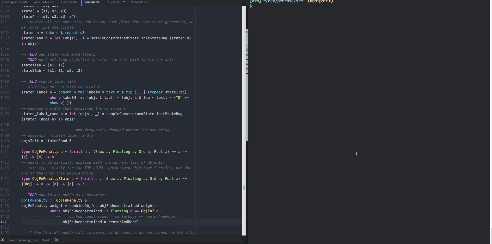
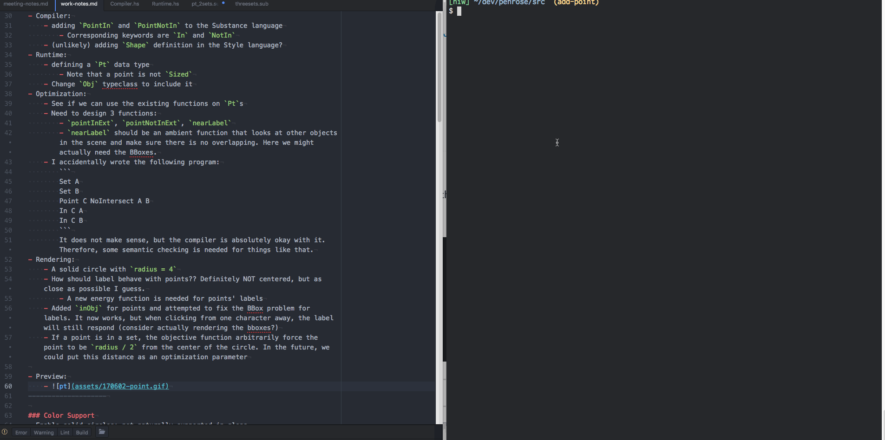
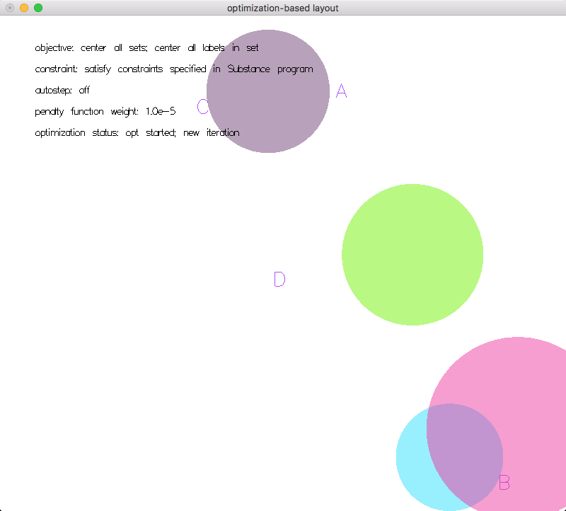
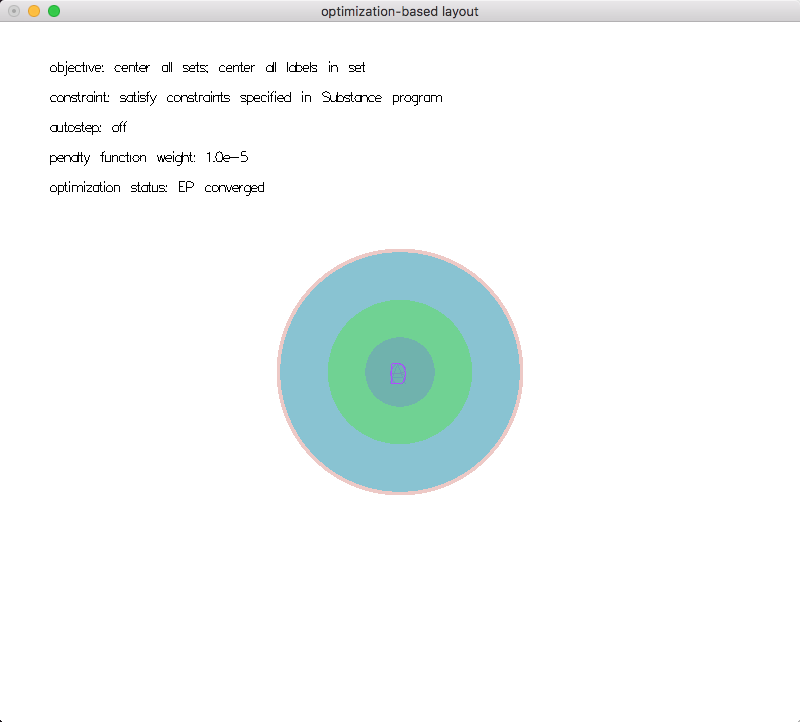

# Penrose Work Notes


## 1. TODOs

- [ ] Label BBox seems to be a little off, but it is now functional
- [ ] A global(ambient) function that make sure labels are not touching anything it shouldn't, labels for set not on the border and etc
    - This might be a complicated problem, we don't know if there is a feasible configuration or not.

## 2. Work log

- [05/31/17]
    - [x] Came up with a quick fix to the label centering issue
    - [x] Solid color for circles
- [06/01/17]
    - [x] Randomize color on start-up
    - [x] Complete Compiler support for `Point`
    - [x] Make a plan for adding Point
    - [x] Test on rendering points in the system
    - [x] Complete the boiler plate section of the code (pack, unpack etc)
- [06/02/17]
    - [x] Fixed parts commented in PR
    - [x] Added the first objective function `pointInExt`
    - [x] Design energy function for `PointIn` and `PointNotIn`
    - [x] Read Katherine's doc on obj fns and come up with questions
        - Read 2.5 times and no problem found, might need details on packing later
## 3. Starter Project

### Adding Points

- Compiler:
    - adding `PointIn` and `PointNotIn` to the Substance language
        - Corresponding keywords are `In` and `NotIn`
    - (unlikely) adding `Shape` definition in the Style language?
- Runtime:
    - defining a `Pt` data type
        - Note that a point is not `Sized`
    - Change `Obj` typeclass to include it
- Optimization:
    - See if we can use the existing functions on `Pt`s
    - Need to design 3 functions:
        - `pointInExt`, `pointNotInExt`, `nearLabel`
        - `nearLabel` should be an ambient function that looks at other objects in the scene and make sure there is no overlapping. Here we might actually need the BBoxes.
    - I accidentally wrote the following program:
        ```
        Set A
        Set B
        Point C NoIntersect A B
        In C A
        In C B
        ```
        It does not make sense, but the compiler is absolutely okay with it. Therefore, some semantic checking is needed for things like that.
- Rendering:
    - A solid circle with `radius = 4`
    - How should label behave with points?? Definitely NOT centered, but as close as possible I guess.
        - A new energy function is needed for points' labels
        - Now just hardcoded labels to be `(10, 20)` away from the center
    - Added `inObj` for points and attempted to fix the BBox problem for labels. It now works, but when clicking from one character away, the label will still respond (consider actually rendering the bboxes?)
    - If a point is in a set, the objective function arbitrarily force the point to be `radius / 2` from the center of the circle. In the future, we could put this distance as an optimization parameter

- Preview:
    - 
    - 
--------------------

### Color Support
- Enable solid circles: not naturally supported in gloss
    - All sets are now `ThickCircle`s with `radius = r/2` and `thickness = r`, which luckily gives us what we wanted
    - To deal with intersections, we could just set the alpha level to `0.5` all the time and have gloss deal with it. Otherwise, I don't know how we could render the intersected region differently.
- Randomize color upon start up:
    - `sampleCoord` is the most relevant function, where parameters for labels and circles are generated
    - TODO: BTW, is `crop` causing the program to hang when we only have one set?
    - After my change in `sampleCoord`. I had to change the `Circ'` definition, and a couple places where objects of `Circ` or `Circ'` types get instantiated.
    - As if now, the colors are completely randomized in `[0.0, 1.0]`. Most of the times they look pretty good.
    - The `Color` type we used is defined in Gloss, not by us.




---------------------

### Centering the texts
- The font is some kind of vector font. According to StackOverFlow, gloss just uses whatever GLUT provides, which is possibly Helvetica Light?
    - According to one of the discussions, it is `GLUT.renderString GLUT.Roman str`, which is unfortunately not monospaced
    - "`Roman`: A proportionally spaced Roman Simplex font for ASCII characters 32 through 127. The maximum top character in the font is 119.05 units; the bottom descends 33.33 units."
    - "`MonoRoman`: A mono-spaced spaced Roman Simplex font (same characters as Roman) for ASCII characters 32 through 127. The maximum top character in the font is 119.05 units; the bottom descends 33.33 units. Each character is 104.76 units wide."
    - https://hackage.haskell.org/package/GLUT-2.7.0.12/docs/Graphics-UI-GLUT-Fonts.html
- It does NOT seem to be monospaced
- The centering offset is quite obvious. See pictures
- Reasons behind this:
    - "The ultimate problem is there are no portable font loader libraries for Haskell"
- Relevant discussions:
    - [Fonts in Gloss](https://groups.google.com/forum/#!searchin/haskell-gloss/text$20font%7Csort:relevance/haskell-gloss/xZGRTfPXfpA/wIRVnG01WzUJ)
- Quick hack: We just treat the width ~~as if it is monospaced~~, height as if it is the tallest. This will give okay adjustment when the label is just a wide character like `A` and `B`
    - I noticed that a half of a monospaced character would be more reasonable estimate, especially when the label gets longer, but this is a hack anyway.


# 4. Random quotes and notes

- "btw the way selection currently works is: if multiple objects overlap, it selects the first one that the cursor is inside in the list of objects."

- this is why the program is hanging if there's only one set. it's a combination of three mistakes on my part:
    1. the constraintflag is on, meaning it wants at least TWO SETS to overlap. first the constraint function should generated from the Substance program s.t. we find an initial state that violates the constraints. it should not hardcoded to be intersection. so i think you should just turn it off for now unless you want to tackle constraint function synthesis (which shouldn't be that hard)

    2. because the constraintflag is on, we call noneOverlap... but that function doesn't deal with labels. it assumes all objects are sets. it should be filtering out all labels (and all constraint functions should be fixed to ignore labels)

    3. noneOverlap calls noOverlapPair, which... returns true if any pair of objects is not two circles. but since there is only one set, the entire state of the world is just one circle and one label, so it always returns true. therefore the `not . noneOverlap` will always evaluate to false, so it will fail to ever find an initial state.

    best solution is to turn off `constraintFlag` and make minor fixes to `noneOverlap` and `noOverlapPair`
