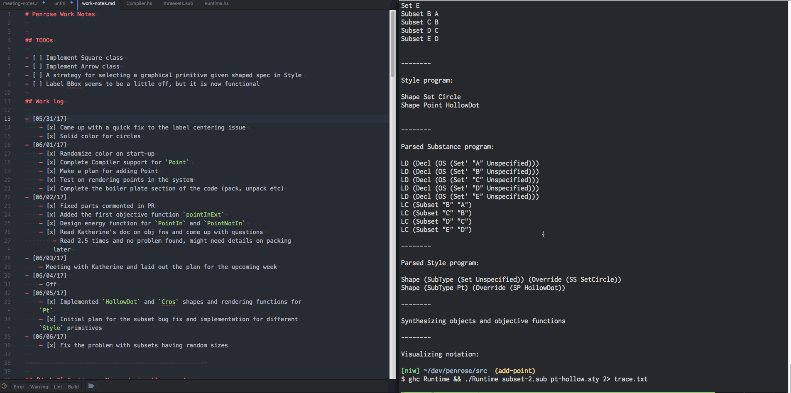
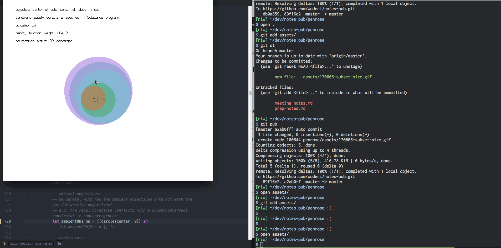
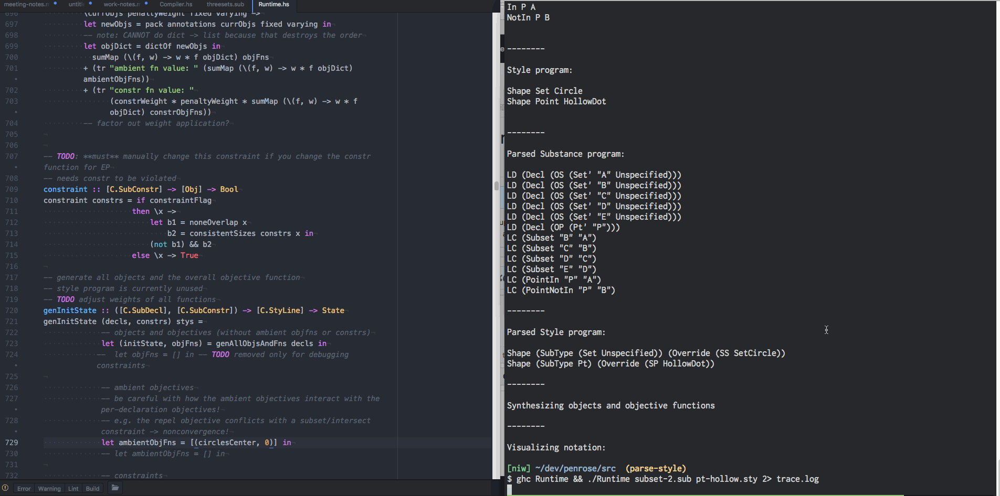
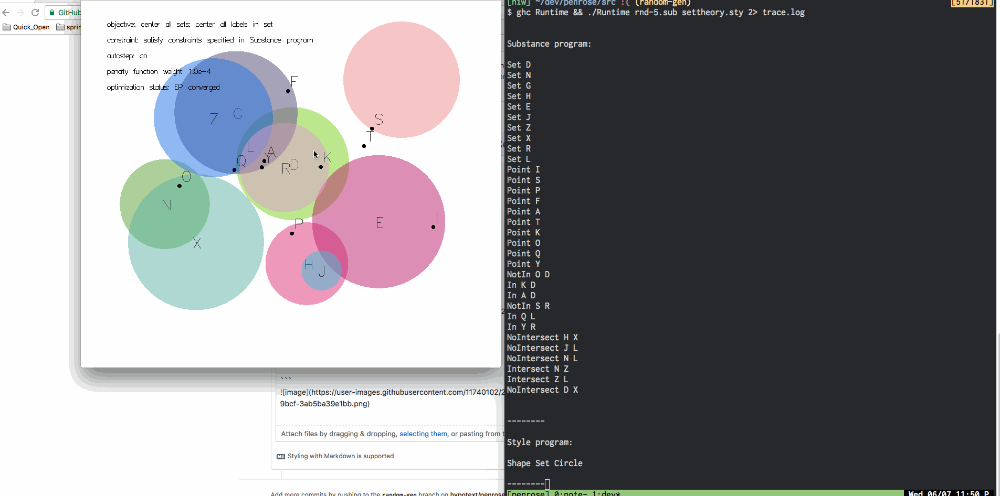
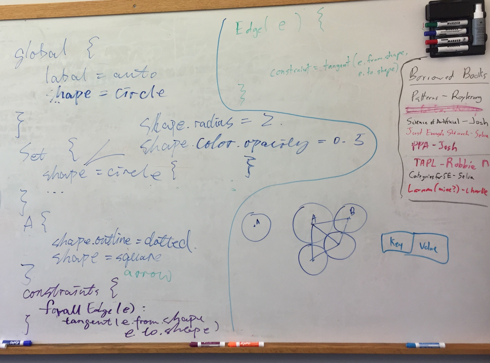

# Penrose Work Notes

# Table of Contents
- [A List of Possible Abstractions](#what-abstractions-do-we-want)
- [Work Log](#work-log)
- [Random Program Generation](#side-project-generating-random-penrose-program)
- [Week 1: Starter Project](#week-1-starter-project)

## TODOs

- [ ] Implement Square related energy functions
    - What is a good design here?
- [ ] Implement Arrow class
- [ ] Implement Arrow related energy functions
- [ ] A strategy for selecting a graphical primitive given shaped spec in Style
- [ ] Label BBox seems to be a little off, but it is now functional
- [ ] Fix the order of selection, or decide not to fix it at all
- [06/12/17]
    - [ ] Prep for Wednesday meeting


---------------------------------------------------

## [Week 2] Continuous Map and miscellaneous fixes

### Should we do Template Haskell??

- Adding a square into the system take two hundred insertions (rough estimation). An incomplete list:
    - Add a type `Square` and a "primed" type `Square'` to make `autodiff` happy
    - Add a render function
    - Add `inObj` function for selection by the user
    - Add energy functions:
        - For set, `subsetFn` has to match with square-square, square-circle, circle-square subset relationships.
    - Add pack and unpack functions, and decided which parameter is varying and which ones are fixed. For instance, I decided to not optimize the angle of the square and make it fixed.
- So, we might really need to add some templated stuffs.

### Parsing the `Style` specifications

- Thoughts on the representation of objects in the system:
    - I am writing because the mapping of the Style dictionary is not exactly clear to me.  
    - We start from a Substance program, which contains:
        - Abstract math objects denoted by identifiers: `Set A`
        - Pairwise (for now) constraints across types: `PointIn P B`, `Subset A B`
    - And then, we parse Substance and get a bunch of `SubDecl`s and `SubConstr`s. We also parse style and get `Styline`s
    - When we start up our runtime, we need to know what the shape each of those math objects has and some specifications about these concrete objects
    - It is clear that we have a new set of objects: math objects with Style information -> styled objects
    - What are those information?
        - Color, line, priority, direction, label, scale, absPos
    - Notice that these styled objects are still different from what we are going to render. For example, labels should be rendered individually (and labels might be the only exception here)
    - Therefore, it might be a good idea to add another layer of abstraction here?


- Possible designs for storage of Style information
    - First, due to my current Haskell ability, some of the proposals might not make sense/isn't optimal
    - **Option 1**: storing the style information directly inside the objects.  
        - For example, for a `Circ`, we add a couple fields such as `shape`, which is of type `SubShape`. I haven't verify this, but I think the pack/unpack process will not throw out fields inside objs?
        - Or we can have objects hold their own render functions?
    - **Option 2**: have a dictionary that does a similar job, which stores a mapping from `Obj`(or some string representation of it, since all `Obj`s are currently named) to some custom type that we can define. For instance, define `StyleInfo` to be a (algebraic?) type. Then I guess we have to ask if location and dimension a part of this type or not?
    - I don't know if this needs to be more complex if we have Style attributes that depends on multiple objects. Line break is a potential one. Then we might need to take that into account, too.
    - Of course, we will need a function that walks through the style AST and properly set up whatever data structure that we will be using.
- Katherine's suggestion:
    - Let's just start by generalizing `Circle` to `Square`. What parts of the system need to change then? The square datatype, for example, needs to contain a center, side length, and angle. Should it contain the endpoint coordinates? How do we label squares? What objective function should be synthesize for the combination of `Set A` and `Shape A Square`? What if one set is a circle and one set is a square? How do we write objective functions on circle-sets, square-sets, and dot-points? It could get very complicated.
    - So, maybe all our shapes should satisfy some kind of "optimization API"/typeclass. As Keenan suggested: maybe our optimization functions should in general only operate on objects that can return answers to "get thickness," "get distance," "get angle," etc. But we might need to know concretely where the borders of a square are in order to avoid putting labels on it. I don't know what the best solution is.
    - Some parts of Style are relevant to the optimization and can be changed by it (e.g. anything numerical, like angle and color), and some aren't (e.g. anything categorical, like whether the shape is a square or a circle). I suggest storing the former as fields in the record (e.g. radius of circle) and the latter as a list of style lines `StyLine`, which is then passed to the render function at the end. The list of style lines for each object will have to take into account the overrides.
    - I would not recommend having objects hold their own render functions. It's a good idea, but we can't easily inspect Haskell functions (meaning we can't compute on them, pattern-match on them...). I usually prefer storing things as data rather than as functions.
        - Is this true??


### Fix to the size problem with `Subset` constraints
- Problem: The initial implementation did not impose any constraint on the sizes of circles when the system samples the initial state. Therefore, we end up with contradictory scenarios where `Set A` is a subset of `Set B` but has a larger radius than `B`
- Solution: I added `[C.SubConstr]` to `State` so that whenever we resample the initial state, we use the constraints, specifically `C.Subset`, to force radius constraints on circles.
- TODO: the implementation is not at all elegant. I had to create another dictionary to store `[Obj]`, instead of the original `[Obj']`, and I do not know storing `C.SubConstr` inside of `State` make snese or not.
- Preview:
    - 
    - 
    - 

----------------------------
## [Week 1] Starter Project

### Adding Points

- Compiler:
    - adding `PointIn` and `PointNotIn` to the Substance language
        - Corresponding keywords are `In` and `NotIn`
    - (unlikely) adding `Shape` definition in the Style language?
- Runtime:
    - defining a `Pt` data type
        - Note that a point is not `Sized`
    - Change `Obj` typeclass to include it
- Optimization:
    - See if we can use the existing functions on `Pt`s
    - Need to design 3 functions:
        - `pointInExt`, `pointNotInExt`, `nearLabel`
        - `nearLabel` should be an ambient function that looks at other objects in the scene and make sure there is no overlapping. Here we might actually need the BBoxes.
    - I accidentally wrote the following program:
        ```
        Set A
        Set B
        Point C NoIntersect A B
        In C A
        In C B
        ```
        It does not make sense, but the compiler is absolutely okay with it. Therefore, some semantic checking is needed for things like that.
- Rendering:
    - A solid circle with `radius = 4`
    - How should label behave with points?? Definitely NOT centered, but as close as possible I guess.
        - A new energy function is needed for points' labels
        - Now just hardcoded labels to be `(10, 20)` away from the center
    - Added `inObj` for points and attempted to fix the BBox problem for labels. It now works, but when clicking from one character away, the label will still respond (consider actually rendering the bboxes?)
    - If a point is in a set, the objective function arbitrarily force the point to be `radius / 2` from the center of the circle. In the future, we could put this distance as an optimization parameter

- Preview:
    - 
    - 
--------------------

### Color Support
- Enable solid circles: not naturally supported in gloss
    - All sets are now `ThickCircle`s with `radius = r/2` and `thickness = r`, which luckily gives us what we wanted
    - To deal with intersections, we could just set the alpha level to `0.5` all the time and have gloss deal with it. Otherwise, I don't know how we could render the intersected region differently.
- Randomize color upon start up:
    - `sampleCoord` is the most relevant function, where parameters for labels and circles are generated
    - TODO: BTW, is `crop` causing the program to hang when we only have one set?
    - After my change in `sampleCoord`. I had to change the `Circ'` definition, and a couple places where objects of `Circ` or `Circ'` types get instantiated.
    - As if now, the colors are completely randomized in `[0.0, 1.0]`. Most of the times they look pretty good.
    - The `Color` type we used is defined in Gloss, not by us.


---------------------

### Centering the texts
- The font is some kind of vector font. According to StackOverFlow, gloss just uses whatever GLUT provides, which is possibly Helvetica Light?
    - According to one of the discussions, it is `GLUT.renderString GLUT.Roman str`, which is unfortunately not monospaced
    - "`Roman`: A proportionally spaced Roman Simplex font for ASCII characters 32 through 127. The maximum top character in the font is 119.05 units; the bottom descends 33.33 units."
    - "`MonoRoman`: A mono-spaced spaced Roman Simplex font (same characters as Roman) for ASCII characters 32 through 127. The maximum top character in the font is 119.05 units; the bottom descends 33.33 units. Each character is 104.76 units wide."
    - https://hackage.haskell.org/package/GLUT-2.7.0.12/docs/Graphics-UI-GLUT-Fonts.html
- It does NOT seem to be monospaced
- The centering offset is quite obvious. See pictures
- Reasons behind this:
    - "The ultimate problem is there are no portable font loader libraries for Haskell"
- Relevant discussions:
    - [Fonts in Gloss](https://groups.google.com/forum/#!searchin/haskell-gloss/text$20font%7Csort:relevance/haskell-gloss/xZGRTfPXfpA/wIRVnG01WzUJ)
- Quick hack: We just treat the width ~~as if it is monospaced~~, height as if it is the tallest. This will give okay adjustment when the label is just a wide character like `A` and `B`
    - I noticed that a half of a monospaced character would be more reasonable estimate, especially when the label gets longer, but this is a hack anyway.


-------------------------
# Side project: generating random Penrose program
- The random generator: `genSub.hs` generates up to 26 objects and arbitrary number of constraints. For example:
- 
- `rnd-1.sub`:
```
Set T
Set V
Set H
Point F
Point R
Point Y
NotIn F T
Subset T V
Subset T H
```

- `rnd-2.sub`:
```
Set E
Set P
Set L
Point A
Point G
Point Y
NotIn A E
Intersect E P
Intersect E L
```


- `rnd-3.sub`
```
Set T
Set C
Set Q
Point G
Point K
Point Y
In G T
NoIntersect T C
Subset T Q
```


- Issues:
    - We only support single character label for now, that's why the number 26
    - When the number of constraints exceeds total possible permutations of pairs of point/set and set/set, we get duplicated constraints. Not sure if this will cause any problem
    - - I insisted on passing around the generator because I want to make sure we can still manually provide a seed and deterministically test the system. (and of course I do not know Monad well)
    - The program behaves correctly on a couple of the edge cases:
        - notation: (numSets, numPts, numSubsetConstrs, numPtConstrs)
        - (0, 5, 0, 5): `genSub: Prelude.!!: index too large`
        - (5, 0, 0, 5): `genSub: Prelude.!!: negative index`
        - (3, 3, 12, 0): starting to get repeated pairs, not sure if it will cause problems
        - (0, 0, 0, 0): printed nothing
        - Also a couple normal cases, seems to be fine.
- Constraints: implemented runtime checking for all constraints. Essentially, whenever the EP optimization converges, we run a round of checking. For each constraint in the Substance program, we check if the layout satisfies it. The result is then printed using `trace`
    - There is also a flag under "frequently used parameter" called `checkStateOn` that controls this behavior.
    Issues:
    - When two circles are tangent, I had to add or subtract by some very small offset to eliminate false positives. The offset I used is `0.1`.
    - The code base is getting a little redundant, which will make our next task, adding style language, even more tedious due to the boiler plate code.
    - Preview: two bad cases, and a big, consistent case. Notice in one inconsistent case the optimizer converged to violating different constraints, which is interesting.
    
- Katherine's Slack post
    * Some thoughts on procedurally generating set theory programs:
    * randomly sample a number of declarations for each kind of object (e.g. point, set, map)
    * assign each declaration a unique one-character name
    * for each subset of declared objects, if there exists a constraint that applies to objects of those types, for each applicable constraint, apply it with some probability.
    (e.g. a subset might be "Point p" and "Set A" and two constraints that might apply to those objects are "p in A" and "p NotIn A")
    * However, this process may produce programs with contradictory constraints, e.g. "p in A" and "p NotInA," or more complex ones like "p in A, A NotSubset B, p in B." We don't currently check for contradictory constraints; our optimizer just produces a diagram that sort-of satisfies the constraints.
    * (from my email to Daniel and Kevin, the NN diagram people)
- Tweakable parameters, e.g. number of decls, constraints, probability of constraint, probability it constrains already-used sets, etc

-------------------------
# Random quotes and notes

- "btw the way selection currently works is: if multiple objects overlap, it selects the first one that the cursor is inside in the list of objects."

- this is why the program is hanging if there's only one set. it's a combination of three mistakes on my part:
    1. the constraintflag is on, meaning it wants at least TWO SETS to overlap. first the constraint function should generated from the Substance program s.t. we find an initial state that violates the constraints. it should not hardcoded to be intersection. so i think you should just turn it off for now unless you want to tackle constraint function synthesis (which shouldn't be that hard)

    2. because the constraintflag is on, we call noneOverlap... but that function doesn't deal with labels. it assumes all objects are sets. it should be filtering out all labels (and all constraint functions should be fixed to ignore labels)

    3. noneOverlap calls noOverlapPair, which... returns true if any pair of objects is not two circles. but since there is only one set, the entire state of the world is just one circle and one label, so it always returns true. therefore the `not . noneOverlap` will always evaluate to false, so it will fail to ever find an initial state.

    best solution is to turn off `constraintFlag` and make minor fixes to `noneOverlap` and `noOverlapPair`

---------------
## Work log

- [06/10/17]
    - [x] Build a key-value store from substance id to style info (C.SubShape for now)
    - [x] Added energy functions and `inObj` function
    - [x] thoughts on object representation in the system
- [06/09/17]
    - [x] Collect Style language related materials
    - [x] Language design writeup: Style design I
    - [x] Implement Square class and continue working on Style parsing
- [06/08/17]
    - [x] Random program generator
    - [x] Create and test checks for all constraints
- [06/07/17]
    - [x] Random generation for set and point constraints
    - [x] Attempted to place all labels at the top level. Graphically, they all worked okay, but the selection is a little off here.
- [06/06/17]
    - [x] Fix the problem with subsets having random sizes
    - [x] Random generation for set/point decls
- [06/05/17]
    - [x] Implemented `HollowDot` and `Cros` shapes and rendering functions for `Pt`
    - [x] Initial plan for the subset bug fix and implementation for different `Style` primitives
- [06/04/17]
    - Off
- [06/03/17]
    - Meeting with Katherine and laid out the plan for the upcoming week
- [06/02/17]
    - [x] Fixed parts commented in PR
    - [x] Added the first objective function `pointInExt`
    - [x] Design energy function for `PointIn` and `PointNotIn`
    - [x] Read Katherine's doc on obj fns and come up with questions
        - Read 2.5 times and no problem found, might need details on packing later
- [06/01/17]
    - [x] Randomize color on start-up
    - [x] Complete Compiler support for `Point`
    - [x] Make a plan for adding Point
    - [x] Test on rendering points in the system
    - [x] Complete the boiler plate section of the code (pack, unpack etc)
- [05/31/17]
    - [x] Came up with a quick fix to the label centering issue
    - [x] Solid color for circles

---------------------------------
## What abstractions do we want?

- An unified interface for objective function
    - Signed distance
    - At the same time, we should allow advanced users to provide their own custom implementations

---
# [170609] Style Language Design Meeting with Jonathan

- Went through a couple of examples:
    - Proposal: object/record based design
    - Slides: Substance/View/Style
        - Jonathan and I both forgot about the intuition behind View.
- Readability issues with the current design: `Color A Yellow 0.5` would not make sense to a person who is new to the language, unless he/she has the grammar or user manual. If we have multiple numerical arguments, it could be even worse. For example, `Shape Set Ractangle 10 20`, which one is width?
- Override policies: Jonathan and I both liked the rules regarding overriding proposed by Katherine (See quote below). These policies do reduce the size and complexity of the program greatly.

> "The main idea behind Style is that every line is an override of some setting at some specificity. There is always some kind of global default style provided. Each line in a Style program specifies an override of a characteristic at one of three levels:
> 1. the global level (over all types)
> 2. the type level (over all variables of that type in Substance)
> 3. the value level (over only variables of that name in Substance)

```
global {
    label = auto -- same thing without this line, using the default value
    shape = circle
}
Set {
    shape = Circle  -- default arguments are used here
    color = Black
}
A {
    shape = Square { side = 3, color = Blue, outline = dotted }
    -- Also possible not to specify the shape and modify fields in the default configuration
    -- shape.color.opacity = 0.5
}
```

- Alternative structure of a style program:
    - For now, a style program is organized as a collection of lines.
    - We discussed another possible JSON-like structure. A style program is a collection of "blocks", either enclosed by `{}` or organized by indentation. We have several types of blocks
        - A `global` block: includes global settings such as "shape = circle", meaning "whatever it is you draw, the default shape is a circle"
        - Several type blocks: corresponds to the types in the Substance language. In our set theory example, they would be `Set`, `Point`, or `Map`.
        - Object blocks: denoted by identifiers of an object declared in the Substance program, the object block contains settings to one specific object
        - (Potentially) a `constraints` block: we are still undecided about the exact content in this block, but the motivation is that we have ambient functions that operates on multiple objects. Thus, this block will define those functions, which implies that all identifiers should be available to this block.
            - We considered the example of a `tangent` constraint. Consider the disk representation of a graph where vertices are circles and if there is an edge between two vertices, the two circles has to be tangent to each other(p.s.: not sure if this is always possible). he `tangent` constraint operates on two circles, but is triggered by an edge, which is a separate object in the Substance program.
            - Again, we could have the constraints specified in the type and object blocks. One possibility, for a rule over the type `Edge`:
                ```
                Edge (e) {
                    constraints += tangent ( e.from.shape, e.to.shape )
                }
                ```
    - Why this syntax??
        - We think this syntax is more Substance-oriented because we structure the program by primitives and types defined in the Substance program.
        - The previous assembly like syntax gets really lengthy and unreadable. Especially when you are trying to track the order of overriding. The aforementioned structure, however, explicitly lay out the hierarchy.

```
global {
    -- Some global config here
}
Vertex {
    -- Vertex styling
}
Edge {
    -- Edge styling
}
constraints {
    forall Edge e {
        tangent ( e.from.shape, e.to.shape )
    }
}
```
- Overlapping: what if we want to make objects that are under other objects to have different styles?
    - Jonathan think instead if a numerical priority level, we can just define two modes for rendering an object: `background` and `foreground`. We have not discussed the syntax for that, but one can easily cook up one. An example:
        ```
        Set {
          foreground:
            shape.outline = solid
          background:
            shape.outline = dotted
        }
        ```
- Semantic checking: we should definitely check the validity of references to identifiers, but we did not agree that we should check for things like `Shape Map Box`, because this restriction is rather arbitrary. The user should have the liberty to represent math objects using unusual graphical primitives.
    - If we really want to check that, I suggested a enum-like syntax in type blocks:
    ```
    Set {
        shape = { circle, square }
    }
    ```
    - Jonathan says this might be over-designing though.
- Jonathan does not see style as something we "query" during runtime, but instead a process of transforming a set of **abstract math objects and rules** to **concrete graphical primitives and layout constraints**, which I agree, especially from an implementation standpoint, because the current scheme i.e. storing lines of style specification does not seem to scale at all.
- Whiteboard notes: 
- Josh made the following comment in the design document, which I think is worth discussing.  
> I suspect you are going to want/need other "levels" in the final version. I think it's very useful to be able to name a which can be associated with an arbitrary number of values. Another option is to enable complex selectors in the style program which match particular values. Either strategy enables common examples like styling all sets that are subsets of R^n to be pink and big while all set s that are subsets of R^m to be green and small
