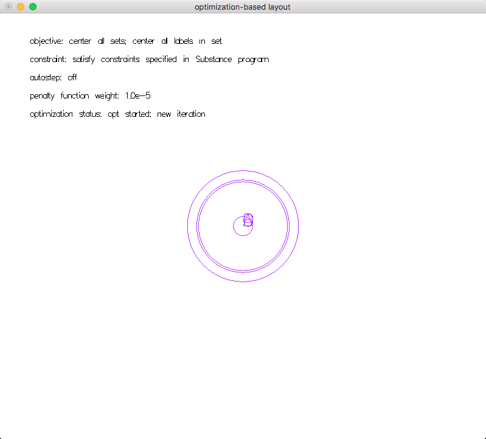
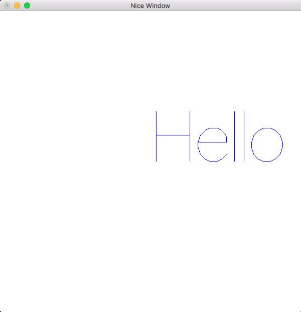
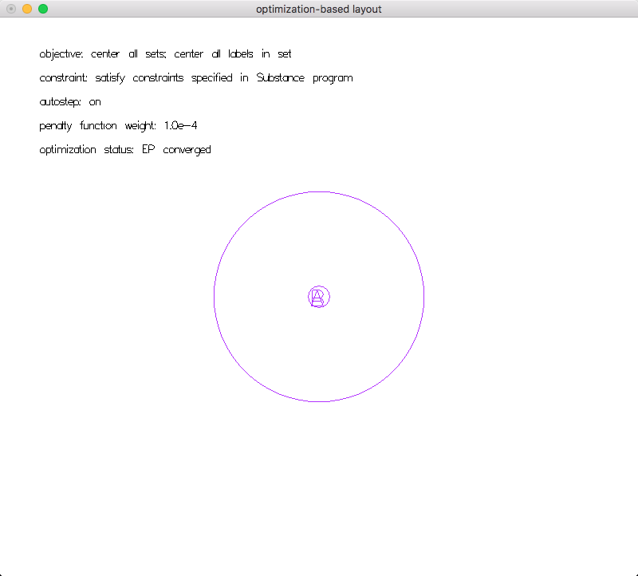

# Penrose Work Notes

## 1. TODOs

- [ ] Adjust the BBox for Labels properly
- [ ] Read Katherine's doc on obj fns and come up with questions

## 2. Work log

- [05/31/17]
    - [x] Came up with a quick fix to the label centering issue
    - [x] Solid color for circles
- [06/01/17]
    - [x] Randomize color on start-up

## 3. Starter Project

- Color Support
    - Enable solid circles: not naturally supported in gloss
        - All sets are now `ThickCircle`s with `radius = r/2` and `thickness = r`, which luckily gives us what we wanted
        - To deal with intersections, we could just set the alpha level to `0.5` all the time and have gloss deal with it. Otherwise, I don't know how we could render the intersected region differently.
    - Randomize color upon start up:
        - `sampleCoord` is the most relevant function, where parameters for labels and circles are generated
        - TODO: BTW, is `crop` causing the program to hang when we only have one set?
        - After my change in `sampleCoord`. I had to change the `Circ'` definition, and a couple places where objects of `Circ` or `Circ'` types get instantiated. 

- Centering the texts:
    - The font is some kind of vector font. According to StackOverFlow, gloss just uses whatever GLUT provides, which is possibly Helvetica Light?
        - According to one of the discussions, it is `GLUT.renderString GLUT.Roman str`, which is unfortunately not monospaced
        - "`Roman`: A proportionally spaced Roman Simplex font for ASCII characters 32 through 127. The maximum top character in the font is 119.05 units; the bottom descends 33.33 units."
        - "`MonoRoman`: A mono-spaced spaced Roman Simplex font (same characters as Roman) for ASCII characters 32 through 127. The maximum top character in the font is 119.05 units; the bottom descends 33.33 units. Each character is 104.76 units wide."
        - https://hackage.haskell.org/package/GLUT-2.7.0.12/docs/Graphics-UI-GLUT-Fonts.html
    - It does NOT seem to be monospaced
    - The centering offset is quite obvious. See pictures
    - Reasons behind this:
        - "The ultimate problem is there are no portable font loader libraries for Haskell"
    - Relevant discussions:
        - [Fonts in Gloss](https://groups.google.com/forum/#!searchin/haskell-gloss/text$20font%7Csort:relevance/haskell-gloss/xZGRTfPXfpA/wIRVnG01WzUJ)
    - Quick hack: We just treat the width as if it is monospaced, height as if it is the tallest. This will give okay adjustment when the label is just a wide character like `A` and `B`

